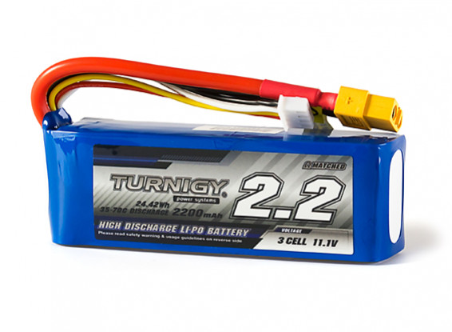

# Batteries

Your robot uses lithium-ion polymer (LiPo) batteries.
These are similar to those used in laptops, and are small and light for
the amount of energy they contain. This is great for your robot but it
is vital to treat such a high concentration of energy with respect. If
you do not, there is a serious risk of fire and injury. To avoid this,
you should follow the safety information on this page closely, at all
times.

:::warning
You must not use any batteries, chargers, bags or cables not explicitly authorised by the event organisers.
:::

## Warnings

-   Never leave batteries unattended when they are in use.
-   Always place the batteries in the provided bag when not in use.
-   If a battery has any cuts, nicks, exposed copper on wires or is
    significantly bulging, report it to a facilitator immediately.

:::danger
Disobeying the above warnings greatly increases the risk of damage to your battery, which can have **fatal consequences**. If you have any questions or doubts, talk to a member of staff immediately.
:::

## Storing batteries

When your batteries are not actively in use, they should be safely stored.
You must disconnect the batteries from all electrical equipment, and place them in the battery charging bag.
You should then store the charging bag in a safe location.

Whenever working on your robot, you should disconnect the battery from the power board.
This is to prevent any accidental short circuits or damage to the battery.

When using power tools to work on your robot, you should remove the battery from the battery case and store it in the charging bag to prevent accidental damage to the battery.

## Operating batteries

To use your batteries, you must connect them to the power board. Do not
tamper with the cable or connect the batteries to anything other than
the power board (or the charger when charging).

:::danger
Mechanical damage to a battery can be dangerous, and a puncture or large force applied to a battery causes a serious risk of fire.
To avoid this, your battery should be shielded from mechanical damage using the provided battery case while you operate it.
Secure the battery case to your robot, so that it does not move or fall off while the robot moves or has accidental collisions.
:::

During operation, the battery is protected by over-current protection
and a fuse in the power board. If any equipment is short circuited, the
over-current protection will activate, protecting the battery. In
extreme circumstances the fuse may blow to prevent damage to the
battery. This is an important safety feature: do not, under any
circumstances, bypass the fuse. It is not user serviceable and if it has
blown then the power board must be replaced. If you suspect the fuse has
blown then please report it to a facilitator.

## Flat batteries

When the battery has been almost completely discharged, the Power Board
will automatically turn off and the LED marked “Power / Flat Battery
Indicator” in the [diagram](./power-board) will
flash red and green. You should immediately disconnect the battery. Flat
batteries should be given to a facilitator in exchange for a freshly charged
battery.

