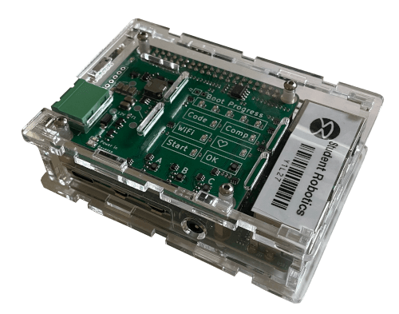
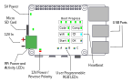

# Raspberry Pi

:::danger
Do not re-flash or edit the SD card. This will stop your robot working!
:::

The brain of your robot is a Raspberry Pi 4B. This handles the running of your python code, recognition of markers and sends control commands to the other boards.

## Power HAT

Your Raspberry Pi has a 'KCH' Power HAT mounted on the top. This allows you to connect power to it using a 7.5mm terminal block.

### Indicator LEDs

There are 18 indicator LEDs on the Pi Power Hat, that can grouped into 3 categories:
- Power status
- Software status
- User LEDs

#### Power Status

These are the 4 LEDs on the left side of the board. They show the status of the power supply to the Raspberry Pi.

| LED              | Meaning
|------------------|-------------------------
| 5V Power         | The Brain Board is powered
| Reg Power        | 5V regulator is functioning
| 12V Power        | 12V power is being provided to the Power Hat
| Reverse Polarity | The 12V power is reversed

#### Software Status

These are the 11 LEDs in the top right of the board, each with a prominent label.
These LEDs show the status of the software running on the Raspberry Pi.
This includes both the software that runs your code, and the overall robot operating system.

| LED              | Meaning
|------------------|-------------------------
| Boot Progress    | Progress Bar for Brain Boot Progress
| Code             | A USB containing code is plugged in
| Comp             | The Robot is in Competition Mode
| WiFi             | The Robot has connected to WiFi and the kit UI is available
| ♥ (Heartbeat)    | Blinks when the Brain is running
| Start            | The Robot is waiting to start
| OK               | Shows the code status, see below table

The key LED to look out for is the `OK` LED, which shows the status of your code.

| OK LED Colour | Meaning
|---------------|--------------------------
| Off           | No code available
| Blue          | Your code is running
| Magenta       | Your code has been killed
| Green         | Your code has finished without errors
| Red           | Your code has crashed

:::tip
The LEDs may take a few seconds to update after you insert or remove your USB.
:::

## Technical Details

Your robot is running a customised version of the [Raspberry Pi OS](https://www.raspberrypi.com/software/) operating system.

When a USB stick is inserted, the software will look for a file named `robot.py`, and then execute it.

The output of your code is written to a file named `log.txt` on the USB stick.
