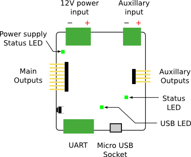

# Servo Board

The Servo Board can be used to control up to 12 RC servos. Many devices
are available that can be controlled as servos, such as RC motor speed
controllers, and these can also be used with the board.

## Board Diagram

## Indicators

| LED   | Meaning              | Initial power-up state |
| ----- | -------------------- | ---------------------- |
| Power | The board is powered | On                     |

## Connectors

There are 8 servo connections on the left-side of the board, and 4 on
the right. Servo cables are connected vertically, with 0V (the black or
brown wire) at the bottom of the board.

For the servo board to operate correctly, you must connect it to the 12V
power rail from the power board. A green LED will light next to the
servo board 12V connector when it is correctly powered and the 8 outputs
on the left-side of the board can be used.

To use the 4 auxillary outputs on the right-side of the board, 5V needs to be connected to the auxillary input.

## Case Dimensions

The case measures 68x68x21mm. Don't forget that the cables will stick
out.

## Range of servos

When using the majority of servos that we supply, you will find that the
servo will only turn about 90 degrees.

## Specification

| Parameter                        | Value       |
| -------------------------------- | ----------- |
| Number of servo channels         | 12          |
| Nominal input voltage            | 11.1V ± 15% |
| Output voltage                   | 5.5V        |
| Maximum total output current[^1] | 10A         |

## Designs

---

You can access the schematics and source code of the firmware on the
servo board in the following places. You do not need this information to
use the board but it may be of interest to some people.

-   [Full Schematics](../assets/docs/servo-schematic.pdf)
-   [Firmware Source](https://github.com/srobo/servo-v4-fw/)
-   [Hardware designs](https://github.com/sourcebots/servo-v4-hw)

[^1]:
    If the auxiliary input is connected, outputs 8-11 have an independent
    maximum current.

