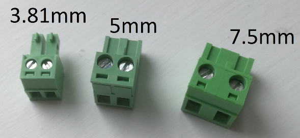

[Terminal blocks](https://uk.farnell.com/-/1757019/-/dp/3705353) are the green connectors used for power wiring within our kit.

Our kit uses 3 different sizes of terminal blocks:

-   3.81mm: Used for auxiliary 5V power
-   5mm: Used to connect motors to the [Motor Board](./motor-board)
-   7.5mm: Used to power other boards off the [Power Board](./power-board)

To use them:

1.  Strip about 1cm of insulation from a length of wire.
2.  Crimp the stripped end into an appropriately sized ferrule.
    Make sure that the metal part of the ferrule is crimped around the stripped end, and that no bare wire is showing.
3.  Insert the ferrule-covered end into the back of a terminal block.
4.  To secure the wire in place, tighten the corresponding screw.

Terminal blocks are keyed such that they can only be inserted one way, and only the correct size will work.

:::warning
Take care in ensuring you connect the correct polarity to the board. Swapping the wires may not work as expected and can damage the boards.
:::

