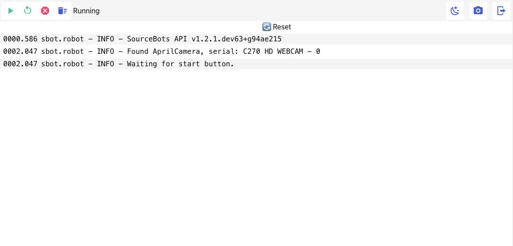
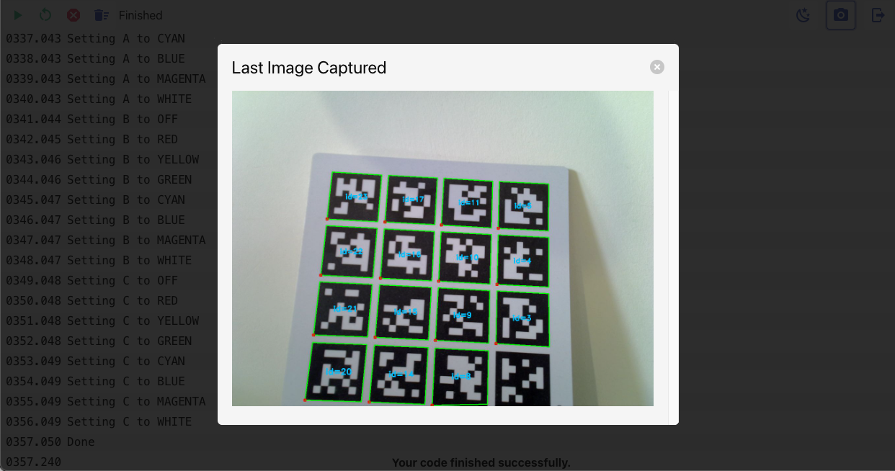

The running of your code on the robot can be controlled through a web interface.
This interface allows you to stop and reset your code, as well as view the logs generated by your code.

## Accessing the Web Interface

To access the web interface, your robot must be connected to the wireless network.
Once connected, the wifi LED on the robot will turn on.
Your facilitator will provide you with the URL of the web interface and your credentials to log in.

Upon logging in, you will be presented with the web interface as below.

The buttons along the top provide the following functionality:
- **Start**: Equivalent to pressing the actual start button on the power board.
- **Reset**: Stop any currently running code and begin running the code from the start.
- **Stop**: Stop any currently running code.
- **Clear Logs**: Clear the logs displayed in the window.
- **Change Theme**: Change the theme of the web interface between light and dark.
- **View Image**: View an annotated version of the last image captured by the camera.
- **Log Out**: Log out of the web interface.

In the main window, you will see the logs generated by your code.
These are the same logs that are saved to `log.txt` on your USB drive but are displayed in real-time.

### Viewing Camera Image

Clicking the on the camera icon will open a new window displaying the last image captured by the camera.
This image will be annotated with the detected markers.

