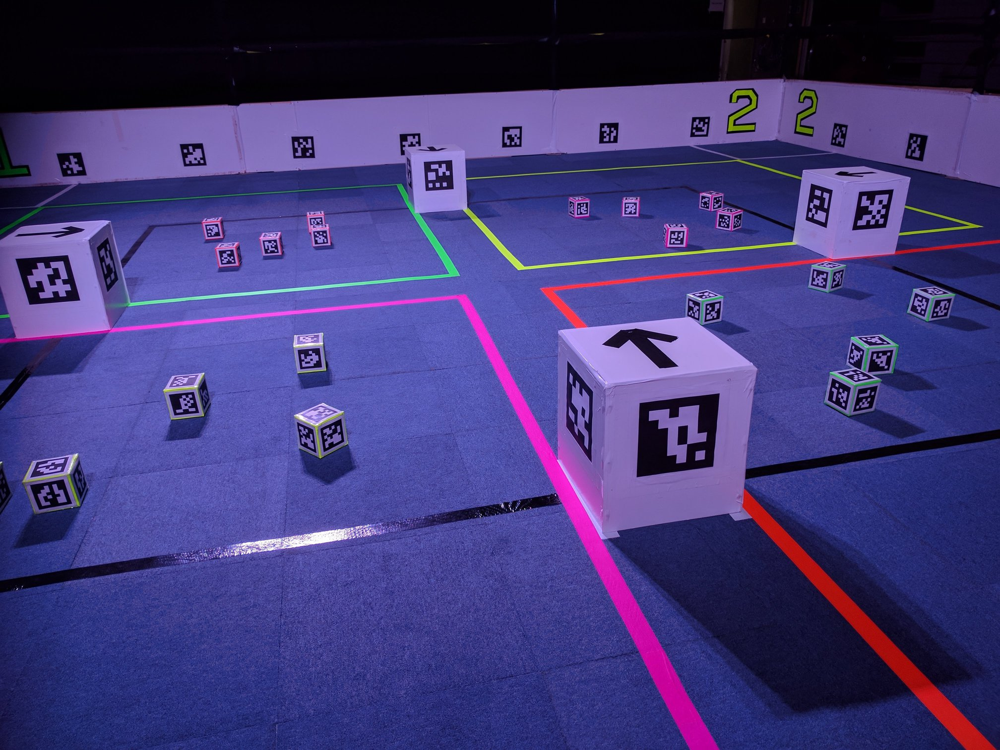
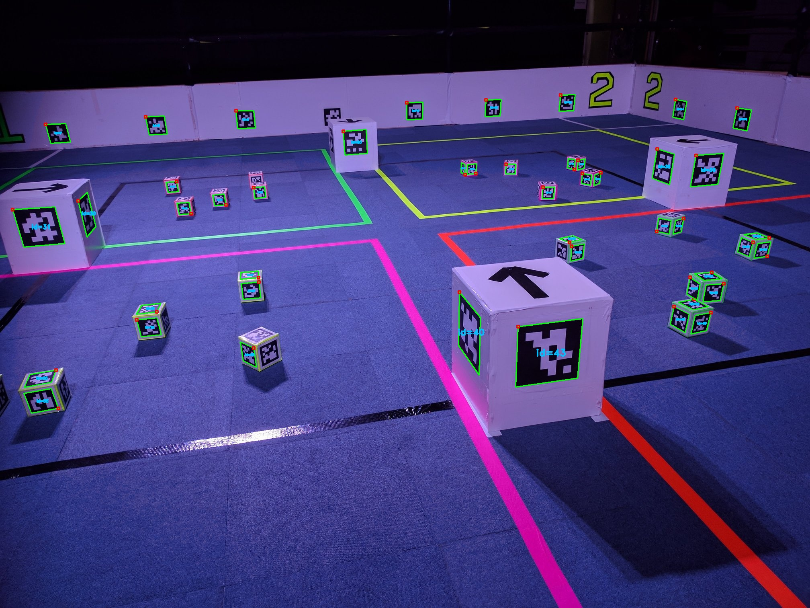

# Vision



Your robot is able to use a webcam to detect [Fiducial Markers](https://en.wikipedia.org/wiki/Fiducial_marker).
Specifically it will detect [AprilTags](https://april.eecs.umich.edu/software/apriltag), using the `36H11` marker set.
Each of these markers acts like a QR-code, encoding a number in a machine-readable way so the robot can identify them.

Using [Pose Estimation](https://en.wikipedia.org/wiki/3D_pose_estimation), it can calculate the orientation and position of
the marker relative to the webcam.
Markers are attached to various items in the arena, in known locations.
Using the marker's poses and their locations, we can either calculate the location of object relative to the robot or the position of the robot relative to the arena.

For information on markers, see the [markers page](./markers).

## Camera

The interface to the vision system is through the camera, accessible through the `vision` module.

### Searching for markers

Assuming you have a webcam connected, you can use `vision.detect_markers()` to take a picture.
The software will process the picture and return a list of [`Marker`](#markers) instances, each of which describes one of the markers that were found in the image.

```python
from sbot import vision

markers = vision.detect_markers()
```

Here's an example that will repeatedly print out the distance, in meters, to each marker that the robot can see:

```python
from sbot import vision

robot = Robot()

while True:
    markers = vision.detect_markers()
    print("I can see", len(markers), "markers:")

    for marker in markers:
        print("Marker #{0} is {1} metres away".format(
            marker.id,
            marker.position.distance / 1000,
        ))
```

:::tip
Taking images while moving will cause them to be blurry, which will cause marker detection to fail.
Try pausing movement while taking an image.
:::

### Saving camera output

You can also save a snapshot of what your webcam is currently seeing. This can be useful to debug your code.

This is done by adding the `save` parameter to the `detect_markers` function.
The parameter should be the filename to where you want to save the image.

Every marker that your robot can see will have a square annotated around it, with a red dot indicating the top left
corner of the marker. The ID of every marker is also written next to it.

Snapshots are saved to your USB drive, and can be viewed on another computer.

```python
from sbot import vision

markers = vision.detect_markers(save="snapshot.jpg")
```



## Markers

Each marker object in the list contains information about a detected marker.
It has the following attributes:

<!-- Uses remark-deflist plugin -->
id
:   The numeric identifier of the marker that can be used to determine what object it represents.

size
:   The physical size of the marker in millimetres, as the vision system expects it.

pixel_centre
:   A [`PixelCoordinates`](#pixel-coordinates) object describing the position of the centre of the marker in the image.

pixel_corners
:   A list of 4 [`PixelCoordinates`](#pixel-coordinates) objects, each representing the position of a corner of the marker in the image.

<dl>
    <dt>position</dt>
    <dd>
    A `Position` object describing the position of the marker.
    See the [Position page](./position) for detailed definitions and diagrams.

    distance
    :   The distance between the camera and the centre of the marker, in millimetres.

    horizontal_angle
    :   Horizontal angle from the centre of the camera's view to the marker, in radians.
        Ranges -&pi; to &pi;.
        Directly in front is zero, positive to the right.

    vertical_angle
    :   Vertical angle from the centre of the camera's view to the marker, in radians.
        Ranges -&pi; to &pi;.
        Directly in front is zero, positive values upwards.
</dd>
</dl>

<dl>
    <dt>orientation</dt>
    <dd>
    An `Orientation` instance describing the orientation of the marker.
    See the [Orientation page](./orientation) for detailed definitions and diagrams.

    yaw
    :   The yaw of the marker, a rotation about the vertical axis, in radians.
        Positive values indicate a rotation clockwise from the perspective of the marker.
        Zero values have the marker facing the camera square-on.

    pitch
    :   The pitch of the marker, a rotation about the transverse axis, in radians.
        Positive values indicate a rotation upwards from the perspective of the marker.
        Zero values have the marker facing the camera square-on.

    roll
    :   The roll of the marker, a rotation about the longitudinal axis, in radians.
        Positive values indicate a rotation clockwise from the perspective of the marker.
        Zero values have the marker facing the camera square-on.
</dd>
</dl>

:::tip
You can use the [`math.degrees`](https://docs.python.org/3/library/math.html#math.degrees) function to convert from radians to degrees.
:::

### Positioning Information

The combination of the `position` and `orientation` attributes of the marker provide a complete description of the physical location and orientation of the marker relative to the camera.

The `position` attribute describes where the marker is, relative to the camera, in 3D space.
See the [Position page](./position) for detailed definitions and diagrams.

The `orientation` attribute describes how the marker is rotated around its center.
See the [Orientation page](./orientation) for detailed definitions and diagrams.

### Pixel Coordinates

The positions of various points on the marker within the image are exposed over the API. This is useful
if you would like to perform your own Computer Vision calculations.

A named tuple of `x` and `y` coordinates for the point, in pixels.
Pixels are counted from the origin of the image, which
conventionally is in the top left corner of the image.


```python
from sbot import vision

robot = Robot()

markers = vision.detect_markers()

for marker in markers:
    # Print the x and y coordinates of the pixel location
    print(marker.pixel_centre.x, marker.pixel_centre.y)
```
