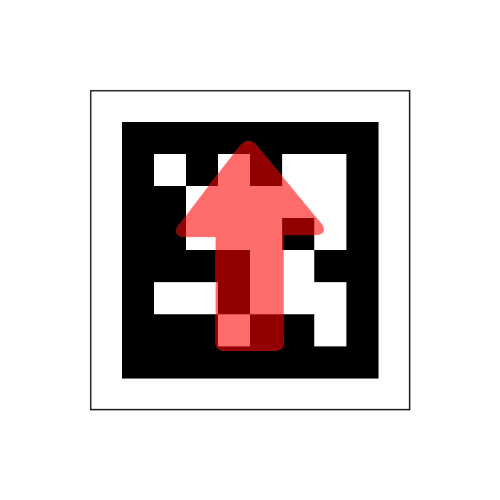
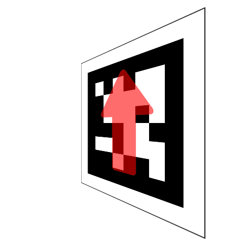
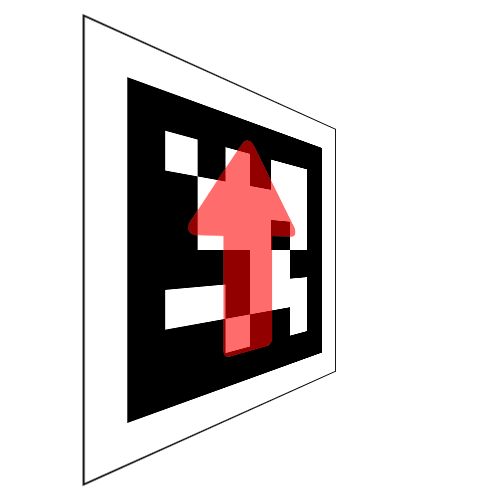
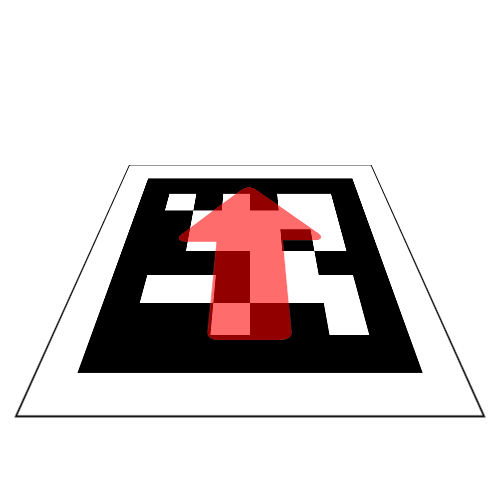
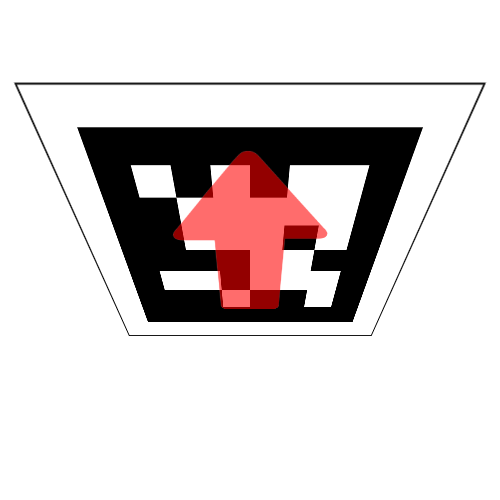
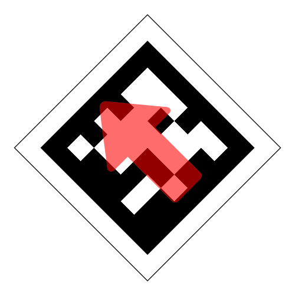
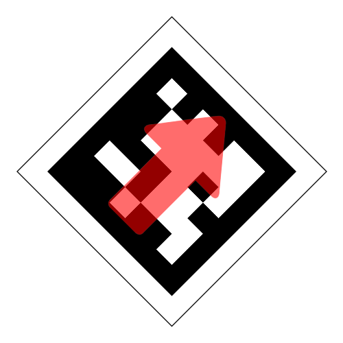

# Orientation


Orientation represents the rotation of a marker around its center.
The axis and rotations follow the [aircraft principal axis](https://en.wikipedia.org/wiki/Aircraft_principal_axes) as shown in the diagram above.
These can be accessed as follows:

<!-- Uses remark-deflist plugin -->
yaw
: The angle of rotation in radians clockwise about the vertical axis, from the perspective of the marker.

pitch
: The angle of rotation in radians upwards about the transverse axis, from the perspective of the marker.

roll
: The angle of rotation in radians clockwise about the longitudinal axis, from the perspective of the marker.

```python
from sbot import *

robot = Robot()

markers = robot.camera.see()

for marker in markers:
   print(marker.orientation.yaw)
   print(marker.orientation.pitch)
   print(marker.orientation.roll)
```

## Examples

The following images visually explains what positive and negative rotations represent. The red arrow is not normally present on the marker but is used in these examples to indicate which way is up.

0 in all axes:

    

|           |                           &pi/4                         |                         -&pi/4                          |
| --------: | :-----------------------------------------------------: | :-----------------------------------------------------: |
|   **yaw** |    |  |
| **pitch** |  |    |
|  **roll** |  |    |

[m0x0y0z]: ../../assets/img/api/vision/m0x0y0z.png
[m-45x0y0z]: ../../assets/img/api/vision/m-45x0y0z.png
[m0x-45y0z]: ../../assets/img/api/vision/m0x-45y0z.png
[m0x0y-45z]: ../../assets/img/api/vision/m0x0y-45z.png
[m0x0y0z]: ../../assets/img/api/vision/m0x0y0z.png
[m0x0y45z]: ../../assets/img/api/vision/m0x0y45z.png
[m0x45y0z]: ../../assets/img/api/vision/m0x45y0z.png
[m45x0y0z]: ../../assets/img/api/vision/m45x0y0z.png

