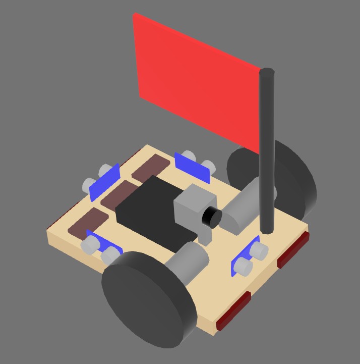
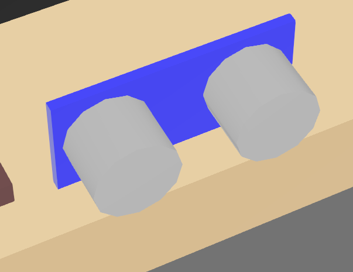
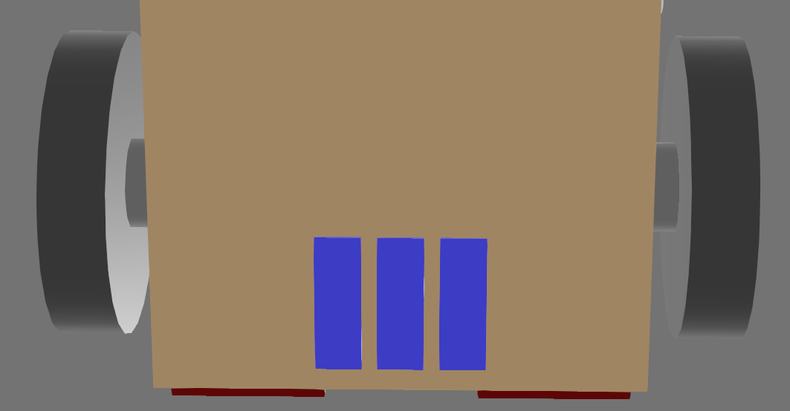
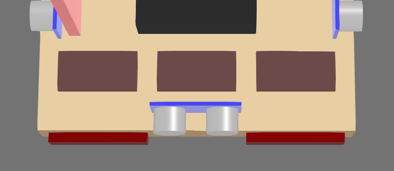

# The Simulated Robot

The simulator contains a pre-built robot model that can be controlled using the sbot library.
The robot is a differential drive robot with a camera and a variety of sensors.

## Attached Boards

The robot has a number of boards attached to it that can be interacted with using the sbot library.
These boards include:

- Power Board (serial number: `PWR`)
- Motor Board (serial number: `MOT`)
    - The left wheel is connected to motor 0.
    - The right wheel is connected to motor 1.
- Servo Board (serial number: `SERVO`)
    - No servos are attached to the simulated robot.
- Arduino Board (serial number: `Arduino1`)
    - The attached sensors are covered in the [Sensors](#attached-sensors) section.
- Camera (serial number: `Camera`)
- LED Board - equivalent to the Brain Board on the real robot (serial number: `LED`)

## Attached Sensors

:::info
The simulated sensors are not perfectly accurate and have artificial noise included to more closely reflect reality.
:::

All sensors are attached to the Arduino board and can be accessed using the [Arduino API](../programming/arduino.md).

| Sensor | Connected Pin | Description |
| ------ | ------------- | ----------- |
| Front Ultrasound Sensor  | Trigger: 2 Echo: 3 | Measures distance from the front of the robot |
| Left Ultrasound Sensor   | Trigger: 4 Echo: 5 | Measures distance from the left of the robot  |
| Right Ultrasound Sensor  | Trigger: 6 Echo: 7 | Measures distance from the right of the robot |
| Back Ultrasound Sensor   | Trigger: 8 Echo: 9 | Measures distance from the back of the robot  |
| Front Left Microswitch   | 10 | Detects if the front left of the robot has bumped into something  |
| Front Right Microswitch  | 11 | Detects if the front right of the robot has bumped into something |
| Rear Left Microswitch    | 12 | Detects if the rear left of the robot has bumped into something   |
| Rear Right Microswitch   | 13 | Detects if the rear right of the robot has bumped into something  |
| Left Reflectance Sensor  | A0 | Measures the reflectance of the surface under the left side of the robot  |
| Center Reflectance Sensor| A1 | Measures the reflectance of the surface under the center of the robot     |
| Right Reflectance Sensor | A2 | Measures the reflectance of the surface under the right side of the robot |

### Ultrasound Sensors

These are the simulated version of [ultrasound sensors](https://robocraze.com/blogs/post/what-is-ultrasonic-sensor).

They return the distance to the nearest object in front of the sensor in a narrow cone of view.
Objects beyond 4 meters are not detected.

The robot has four ultrasound sensors attached to it, one on each side of the robot.
They can all be accessed using the Arduino API's [ultrasound interface](../programming/arduino#ultrasound-sensors).

:::info
Since these sensors rely on echoes being reflected back from objects, if the angle of incidence between the sensor's pulse and the contacted surface exceeds 22.5 degrees then the sensor will be unable to detect the object.
:::

These appear as a blue board with two silver cylinders on the robot model.
The returned distance is measured from the blue board in the direction of the silver cylinders.

### Reflectance Sensors

Across the bottom of the robot, there are three reflectance sensors that can detect differences in the colour of the surface under the robot.
This is achieved by returning the relative red content of the surface directly below the sensor.

The measured values can then be read using the [Analog Input](../programming/arduino.md#analog-input) interface.
This is returned as a voltage between 0 and 5 volts, with lower values indicating a lighter surface.

These appear as blue rectangles on the robot model.

### Microswitches

On the front and back of the robot, there are microswitches that can detect if the robot has bumped into something.
These appear as red cuboids on the robot model.

The attached pin will read `True` if the cuboid has intersected with any other object in the simulation.

## LEDs

The three rectangles on the back of the robot can have their colours set using the [Pi LEDs](../programming/pi-leds.md) interface.
