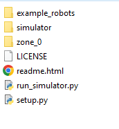
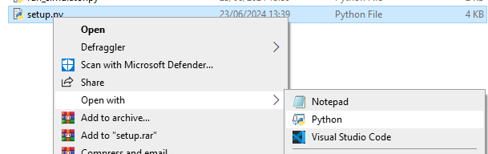
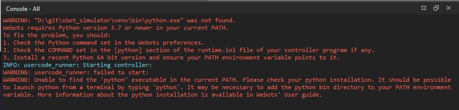
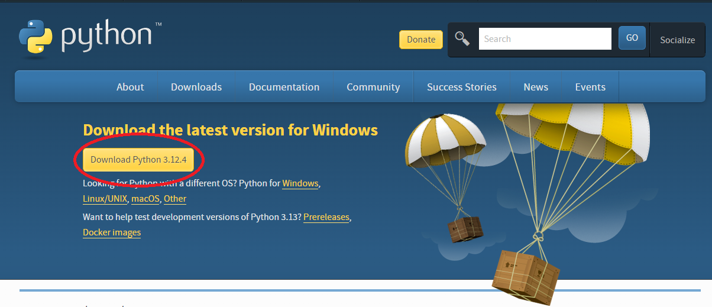
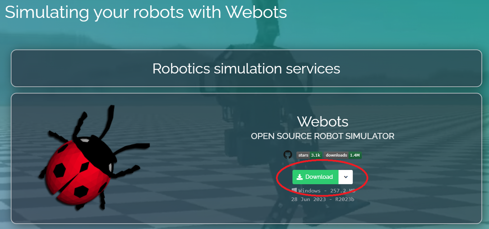

import styles from './styles.module.css';

# Setting up the Simulator

## Required Software

In order to use the simulator a few set-up steps need to be done.

For the summer school, all the required software is pre-installed on the lab machines so you can continue to the next step.

To run the simulator on a personal device you will need to install this software, see [Usage on Other Machines](#usage-on-other-machines);

## Simulator Bundle

Once you have installed these, you need to download our [simulator bundle](https://github.com/sourcebots/sbot_simulator/releases/download/2025.1.2/sbot-simulator-2025.1.2.zip).
This is a zip file containing the arena and the necessary files to allow the sbot library to be used in the simulator.

Once this has downloaded, extract the contents to an empty folder.
This folder will contain the arena as well as the code you will develop to control the robot.

:::tip
The contents of the folder should look like this:

:::

-   The `simulator` folder contains our code to support running your code in the simulator.
-   The `zone_0` folder is where you will write your code, and it must contain a file called `robot.py`.
-   The `setup.py` and `run_simulator.py` files are used to set up the environment and run the simulator respectively.
-   The `readme.html` file contains a single page guide to using the simulator, similar to this one.

:::tip
If you had previously downloaded the simulator, you can copy your code from the previous installation by copying just the `zone_0` folder from the old installation to the new one.
:::

## Setting up the Environment

Now that you have downloaded and extracted the simulator, you need to set up the environment to run the simulator.
Since the simulator uses the sbot library, there are a series of python packages that need to be installed and Webots needs to be configured to use the correct version of Python.
We have provided a script that will set up this environment for you.

First, navigate to the folder you extracted the simulator into. This folder should contain a file called `setup.py`.
Run this script and it will set up the environment for you.
A terminal window will open and you will see the output of the script, if there are any errors displayed you should ask a facilitator for help.

:::tip
In order to run the Python script, instead of opening the file you may need to right-click and select **Open with** &rarr; **Python**.

:::

:::info
On recent versions of macOS you may need to give Python permission to access the directory where you have extracted the simulation files.
:::

This will create a contained python installation with the required libraries in a `venv` folder, this is called a virtual environment.
This also configures the Webots settings to use the correct version of Python.

## Troubleshooting

There are a few common issues that you may encounter when setting up the simulator.
You may receive a warning about your computer's GPU not being good enough, which can be ignored.

If you see a message saying that Python cannot be found that looks similar to the image below, you need to rerun the setup script and check if it displays any errors.

### Performance Optimisations

The default settings work for most users however if you are using a less powerful computer or one without a dedicated graphics card (as is the case on many laptops), you may wish to adjust the graphics settings to enable the simulation to run faster.

If you find that the simulation runs very slowly we suggest disabling Anti-Aliasing, Ambient Occlusion and Shadows.
These should not affect the behaviour of the simulation, only the rendered visuals.

To do this, open Webots and go to the menu **Tools** &rarr; **Preferences**, then select the **OpenGL** tab.
On this tab, set **Ambient Occlusion** to "Disabled" and check the boxes next to "Disable shadows" and "Disable anti-aliasing".

On macOS, **Preferences** is under the **Webots** menu instead of **Tools**.

### Usage on Other Machines

Whilst the lab machines are pre-setup with the required software, to use the simulator on a personal device these programs must first be installed.
First you need to install Python 3.8+ and Webots R2023b.

To install Python, you can download the latest version from the [Python website](https://www.python.org/downloads/). If you have already installed Python from a package manager, such as homebrew on MacOS, apt on Ubuntu, or the Windows store on Windows, you can skip this step.

To install Webots, you can download the latest version from the [Webots website](https://cyberbotics.com/#download). Use the default settings when installing Webots.

