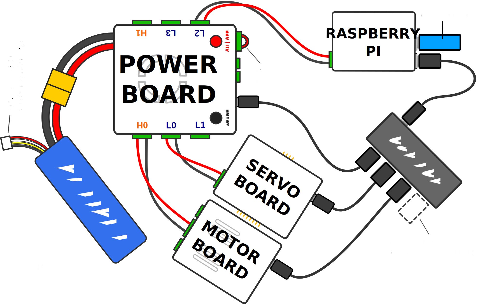

# Connecting Your Kit

## Essential hardware

-   [Raspberry Pi](../kit/pi.md)
-   [Power Board](../kit/power-board.md)
-   [Motor Board](../kit/motor-board.md)
-   [Arduino](../kit/arduino.md)
-   A [Battery](../kit/batteries.md)
-   USB Hub

## Connectors and cables

-   4 x 5mm terminal blocks (for the Motors)
-   1 x 5mm terminal block with wire loop (attached to the Power Board)
-   6 x 7.5mm terminal blocks (for the Raspberry Pi, and Motor Board)
-   3 x USB-A to micro-USB cables
-   USB-A to USB-C cable (for the Arduino)
-   Thick, black, stranded wire
-   Thick, red, stranded wire
-   Thick stranded wire in any other colour

:::tip
[Terminal Blocks](../kit/terminal-blocks.md) are the green connectors used for power wiring within our kit.
:::

## Peripherals

-   2 x Motors
-   Ultrasound distance sensors
-   USB memory stick

## Tools you’ll need

-   Wire Cutters
-   Wire Strippers
-   Crimping Tool
-   Screwdriver (2mm flat-head)

You will need to fetch any other needed tools/supplies yourself.

## Important notes before you start

:::warning
Make sure to read all these **before** you start assembly.
:::

-   Do not disassemble/reassemble your kit without first switching it off by
    pressing the red button.

-   Always be careful handling your battery, only ever plug it into the power
    board (the board with a fan).

-   Check your kit thoroughly before switching it on again. If something is
    connected up incorrectly when the kit is powered up, it may break the kit!

-   When making your own wires, especially those with terminal blocks on the end,
    always double-check that the correct connections are made at either
    end (positive to positive, ground to ground, etc.) before plugging in
    the cable or plugging in the battery and switching things on.
    Don’t be afraid to ask someone to check your connections.

-   Colour coding is key; please use _red_ for wires connected to
    power (say 12V or 5V), _black_ for wires connected to ground
    (0V) and _any other colour_ for motors.

## How it all fits together

The first step of your robot is assembly! Here we'll guide you step-by-step on
how to connect things up. You'll be cutting your own wires here!

1.  Connect the Raspberry Pi to the Power Board by screwing the two 7.5mm
    (large) terminal blocks provided onto the opposite ends of a pair of
    wires, ensuring that positive connects to positive and ground to
    ground. Plug one end into the Pi, and the other end into the `L2`
    socket on the Power Board.
2.  Connect the USB hub to the Pi by plugging it into any one of its four USB
    sockets.
3.  Connect the Power Board to the Pi via one of the pink micro-USB cables; the
    standard USB end goes into any USB socket on the Pi or connected USB hub, and
    the micro-USB end into the Power Board.
4.  Connect the Motor Board to the Power Board with a cable made with two 7.5mm
    (large) terminal blocks. Plug one end into the appropriate socket of the
    Motor Board and the other into a high power socket (marked `H0` or `H1`) on
    the side of the Power Board.
5.  Connect the Motor Board to the Pi by way of another micro-USB cable; the big
    end goes into any USB socket on the Pi or connected USB hub, the micro-USB
    end goes into the Motor Board.
6.  Connect the Arduino to the Pi by way of the USB-A (rectangle) to USB-C
    (oval-ish) cable.
7.  To connect the motors, make a cable using two 5mm (medium) terminal blocks
    provided and any colour of thick wire that isn't red or black. You can then
    use this cable to connect a motor to the `M0` or `M1` port on the motor
    board.
8.  At this point, check that everything is connected up correctly (it may be
    helpful to ask someone to check that all cables are connected
    properly).
9.  Connect the Power Board to your LiPo battery by plugging the yellow
    connector on the cable connected to the Power Board into its counterpart
    on the battery.
10. If there is not one plugged in already, a loop of wire should be connected
    to the socket beneath the On|Off switch. Check that the Power Board works by
    pressing the On|Off switch and checking that the LED next to the power
    socket on the Raspberry Pi lights up green.

:::warning
The Brain Board **must** be plugged in to the `L2` port on the Power Board in order for the kit to start up.

The `L2` port is the only port on the Power Board which is powered before the Brain Board has started, so is the only one which can be used to power the Brain Board.
:::
